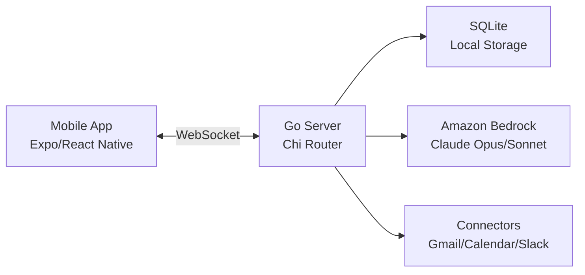

# 🫧 Gummy Bots

> Flick tasks at your AI bot. The first trust-native interface for AI agents.

<p align="center">
  
  <br>
  <em>Flick colorful task bubbles at your AI bot. Physics-based, satisfying, private.</em>
</p>

## What is Gummy Bots?

**Gummy Bots** turns task management into a tactile game. Your AI bot sits at the center of the screen. Tasks appear as colorful "gummies" orbiting around it. Flick a gummy at the bot — it catches it, executes the task, done.

The flick is more than a game mechanic — it's a **consent primitive**. A physical, visceral, unambiguous way to authorize AI action. No anxiety about autonomous agents doing things you didn't approve. The flick is your explicit authorization gate.

Inspired by *bilhar/gude* (Brazilian street marble games), Gummy Bots brings the precision and satisfaction of flicking a marble at a target to your daily workflow. But instead of marbles, you're delegating tasks. Instead of a street game, you're managing your life.

## Demo

<p align="center">
  
  <br>
  <em>Flick a task → Bot catches it → AI executes → Satisfying pop</em>
</p>

## Features

- 🎯 **Physics-based flick mechanic** — Aim and flick task bubbles with real momentum, gravity wells, and magnetic snapping
- 🤖 **AI bot that executes** — Powered by Claude (Amazon Bedrock), the bot drafts emails, books appointments, and handles tasks
- 🎨 **Color-coded gummies** — Blue (comms), green (calendar), orange (info), red (urgent), purple (automation)
- 📳 **Multisensory feedback** — ASMR pop sounds, haptic vibration, particle burst animations on every completion
- 🎮 **Gamification** — XP, levels, daily streaks, combo multipliers, bot evolution (4 visual stages), achievements
- 🔌 **Connectors** — Gmail, Google Calendar, Slack, RSS feeds (mock connectors in v0.1, real OAuth2 coming)
- 🔒 **Local-first & private** — All data stored locally in SQLite, LLM calls go to Bedrock (zero-retention endpoints)
- 📱 **Mobile-first** — Built with Expo/React Native, optimized for iOS and Android

## Architecture



**Key components:**
- **Mobile app:** Physics engine (React Native Reanimated + Skia), gesture handling, 60fps animations
- **Go server:** WebSocket hub, agent orchestration (monitor agent + executor agent), OAuth2 connectors
- **LLM agents:** Monitor agent (read-only, generates gummies), Executor agent (flick-triggered, takes action)
- **Security model:** Human-in-the-loop via flick gesture — no autonomous execution without explicit authorization

## Quick Start

### Prerequisites
- Node.js 22+
- Go 1.22+
- Expo CLI (`npm install -g expo-cli`)
- iOS Simulator or Android Emulator (or physical device with Expo Go)

### 1. Clone the repo
```bash
git clone https://github.com/valter-silva-au/gummy-bots.git
cd gummy-bots
```

### 2. Start the backend
```bash
cd server
go run .
# Server runs on http://localhost:8080
```

### 3. Start the mobile app
```bash
cd gummy-bots-app
npm install
npx expo start
```

Press `i` for iOS simulator or `a` for Android emulator.

### 4. Try it out
The app comes with 20 realistic mock tasks that appear every 15-30 seconds. Flick them at the bot to complete them. Build combo streaks. Watch your bot evolve as you level up.

**Note:** Real connectors (Gmail, Calendar) are coming in Phase 2. The current version uses local mock data and runs in standalone mode (no server required).

## Tech Stack

| Layer | Technology |
|-------|-----------|
| **Mobile** | Expo SDK, React Native, TypeScript |
| **Animations** | React Native Reanimated, React Native Skia |
| **Gestures** | React Native Gesture Handler v2 |
| **Backend** | Go 1.22, Chi router, Gorilla WebSocket |
| **Database** | SQLite (modernc.org) |
| **LLM** | Amazon Bedrock (Claude Opus 4.6, Sonnet 4.6) |
| **Auth** | OAuth2 (future), API key auth (current) |

## Roadmap

### Phase 2: Launch Prep (March 2026)
- [ ] Record TikTok-style demo videos (slow-mo, ASMR audio)
- [ ] Ship to TestFlight for beta testing
- [ ] Landing page with waitlist (gummybots.app)
- [ ] Measure video response and validate market demand

### Phase 3: Real Connectors (April 2026)
- [ ] Gmail OAuth2 connector (read, reply, archive, compose)
- [ ] Google Calendar OAuth2 connector (view, create, reschedule, RSVP)
- [ ] Slack connector (read, quick reply)
- [ ] Deploy Go server to Fly.io (~$5/mo per user)

### Phase 4: App Store Launch (May 2026)
- [ ] App Store submission (iOS)
- [ ] Play Store submission (Android)
- [ ] Public launch with viral videos
- [ ] Free tier + Pro subscription ($4.99/mo)

### Future
- [ ] Desktop app (macOS/Windows menubar agent)
- [ ] Team Mode (shared bot, delegation between humans)
- [ ] Bot skins store (cosmetic IAP, if daily engagement > 5 min)
- [ ] Voice mode (tap bot → speak task → bot does it)

## Contributing

Gummy Bots is currently in early development (Phase 1 complete, Phase 2 in progress). Contributions are welcome once we open source the connectors framework.

**For now:**
- Star the repo to follow progress
- Join the waitlist at [gummybots.app](https://gummybots.app) (coming soon)
- Watch the demo videos on TikTok/Twitter (coming March 2026)

## Project Structure

```
gummy-bots/
├── gummy-bots-app/        # Expo mobile app (iOS + Android)
│   ├── App.tsx            # Entry point
│   └── src/components/    # BotOrb, GummyField, StatusHeader, etc.
├── server/                # Go backend (HTTP + WebSocket)
│   ├── main.go            # Server entry point
│   └── internal/          # api, agent, connector, store, physics
├── landing/               # Landing page with waitlist (coming soon)
├── web/                   # React web app (deprioritized per YC feedback)
├── docs/                  # Product vision, market research, architecture
├── memory-bank/           # Project context for AI dev workflow
└── sprints/               # Sprint contracts and evaluations (14 sprints complete)
```

## Development Workflow

This project uses a unique **3-agent sprint harness** for development:
1. **Plan** — Pick next feature from backlog
2. **Contract** — Write acceptance criteria (physics feel, visual design, originality, craft, functionality)
3. **Build** — Implement one feature, commit
4. **Evaluate** — Grade against 5 criteria (must score 6+/10 on all)
5. **Iterate** — Fix and re-evaluate if any score < 6/10

See `docs/harness.md` for details.

## License

MIT

---

*Built by [Valter Silva](https://github.com/valter-silva-au) — Perth, Australia — March 2026*

**Status:** Phase 1 complete (14 sprints, 5,000+ lines of code, full working prototype)
