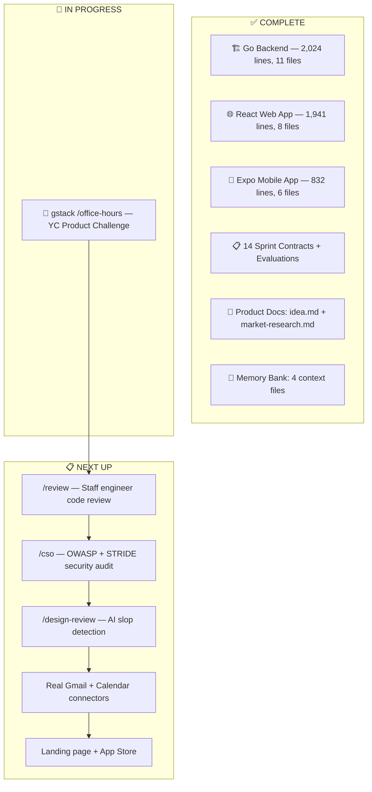
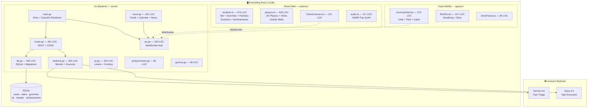
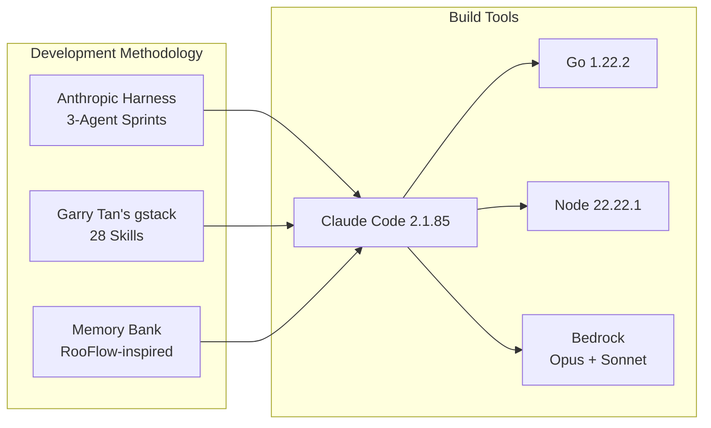
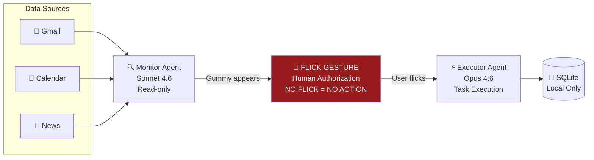
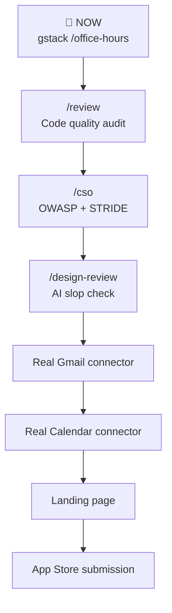

# 🫧 Gummy Bots — Project Progress Report #2

> **Date:** 2026-03-27 22:24 AWST
> **Repo:** [github.com/valter-silva-au/gummy-bots](https://github.com/valter-silva-au/gummy-bots)
> **Overall Status:** ✅ v1 Build Complete | 🔄 Product Review In Progress

---

## Project Timeline

```mermaid
gantt
    title From Voice Memo to Working Product in 26 Hours
    dateFormat HH:mm
    axisFormat %H:%M

    section Day 1 (Mar 26)
    Voice memo - bilhar concept       :d1a, 20:06, 4min
    Named "Gummy Bots"                :d1b, 22:07, 3min
    Concept doc written               :d1c, 22:08, 2min

    section Day 2 (Mar 27)
    Deep market research (58 sources)  :d2a, 17:17, 51min
    GitHub repo created               :d2b, 18:08, 2min
    CLAUDE.md + Memory Bank            :d2c, 18:10, 5min
    Harness + Sprint Backlog           :d2d, 18:35, 5min
    gstack installed (28 skills)       :d2e, 22:20, 4min

    section Build (47 min)
    Sprint 1-4 Foundation              :b1, 18:57, 16min
    Sprint 5-8 Core Loop               :b2, after b1, 13min
    Sprint 9-11 Intelligence           :b3, after b2, 8min
    Sprint 12-14 Polish                :b4, after b3, 10min

    section Review
    gstack office-hours (running)      :active, r1, 22:21, 20min
```

---

## Current State

---

## Architecture

---

## Sprint Delivery

```mermaid
flowchart LR
    subgraph P1["Phase 1: Foundation"]
        S1["S1: Go Server\n✅ 7.8"]
        S2["S2: Bedrock LLM\n✅ 7.8"]
        S3["S3: Mobile Physics\n✅ 8.0"]
        S4["S4: React Web\n✅ 7.8"]
    end

    subgraph P2["Phase 2: Core Loop"]
        S5["S5: Task Pipeline\n✅ 7.8"]
        S6["S6: ASMR Feedback\n✅ 7.8"]
        S7["S7: Bot States\n✅ 7.8"]
        S8["S8: XP + Streaks\n✅ 7.8"]
    end

    subgraph P3["Phase 3: Intelligence"]
        S911["S9-11: Orbits +\nTooltips + Connectors\n✅ 8.8"]
    end

    subgraph P4["Phase 4: Polish"]
        S12["S12: Bot Evolution\n✅ 7.8"]
        S13["S13: Achievements\n✅ 8.0"]
        S14["S14: Integration\n✅ 8.0"]
    end

    S1 --> S2 --> S3 --> S4
    S4 --> S5 --> S6 --> S7 --> S8
    S8 --> S911
    S911 --> S12 --> S13 --> S14
```

---

## Tooling Stack

---

## Security Architecture

> **Key insight:** Indirect prompt injection is the #1 threat to email-reading AI agents. The flick mechanic solves this architecturally — a malicious email cannot trigger autonomous execution because the physical gesture IS the authorization.

---

## Metrics

| Metric | Value |
|--------|-------|
| **Total commits** | 16 |
| **Total code** | 4,797 lines |
| **Go backend** | 2,024 lines (11 files) |
| **React web** | 1,941 lines (8 files) |
| **Expo mobile** | 832 lines (6 files) |
| **Sprint docs** | 28 files (contracts + evaluations) |
| **Product docs** | 8 files |
| **gstack skills** | 28 installed |
| **Build time** | 47 minutes (14 sprints) |
| **Avg sprint score** | 7.9/10 |
| **Highest score** | 8.8/10 (Sprint 9-11) |
| **Time from idea to v1** | ~26 hours |

---

## Feature Status

### ✅ Complete (22 features)

| Category | Feature |
|----------|---------|
| **Core** | Flick-to-execute physics |
| | Magnetic snapping + gravity wells |
| | Bot catch animation (squish + glow) |
| | Dismiss/snooze (flick away) |
| | WebSocket real-time sync |
| | Bedrock LLM integration |
| **Gamification** | XP + Level progression |
| | Daily streaks |
| | Combo multiplier |
| | 8 Achievements + trophy panel |
| **Visual** | Bot personality (4 states: idle, thinking, working, celebrating) |
| | Bot evolution (4 stages tied to level) |
| | ASMR pop audio + particle effects |
| | Dark game aesthetic (#0a0a1a) |
| **Backend** | Go HTTP + WebSocket server |
| | SQLite persistence |
| | Monitor agent (Sonnet 4.6) |
| | Executor agent (Opus 4.6) |
| | Task pipeline (create → gummy → flick → execute) |
| **Connectors** | Mock Gmail (auto-generates gummies) |
| | Mock Calendar (auto-generates gummies) |
| | Mock News (auto-generates gummies) |

### 🔲 TODO (8 features)

| Category | Feature | Effort |
|----------|---------|--------|
| **Connectors** | Real Gmail OAuth2 | 2-3 days |
| | Real Calendar OAuth2 | 1-2 days |
| | Real Slack OAuth2 | 1-2 days |
| **Monetization** | Bot skins store + IAP | 3-4 days |
| | Sound packs + IAP | 2-3 days |
| | Pro tier subscription | 2-3 days |
| **Distribution** | Landing page | 1 day |
| | App Store / Play Store | 2-3 days |

---

## Active: gstack /office-hours

Currently running Garry Tan's YC-style product interrogation:

1. **Challenge product framing** — is "gamified task flicking" the real product?
2. **Push back on assumptions** — is physics-as-moat defensible?
3. **Question monetization** — will bot skins generate revenue?
4. **Probe go-to-market** — how do we get first 1,000 users?
5. **Find the 10-star product** — what's the bigger vision hiding inside?

---

## Roadmap

---

*Generated: 2026-03-27 22:30 AWST | Project age: ~26 hours from voice memo to working product*
