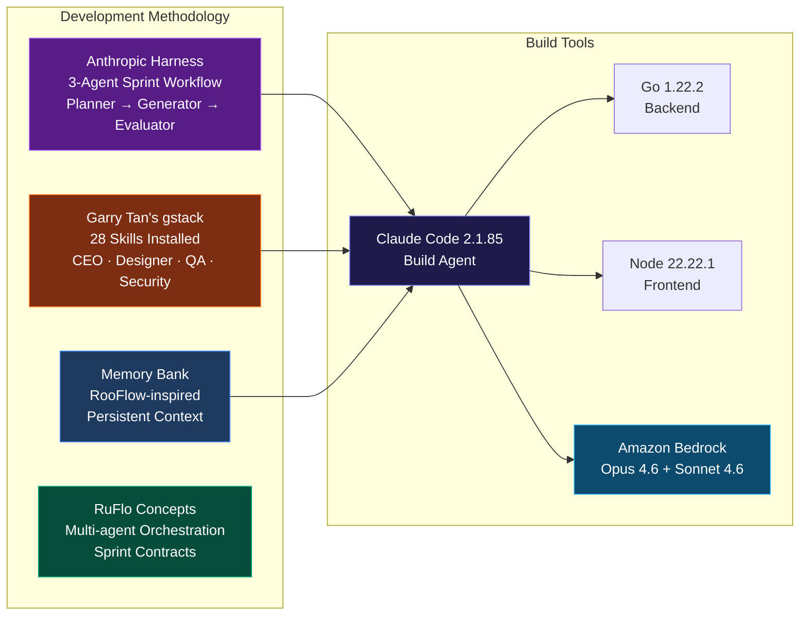
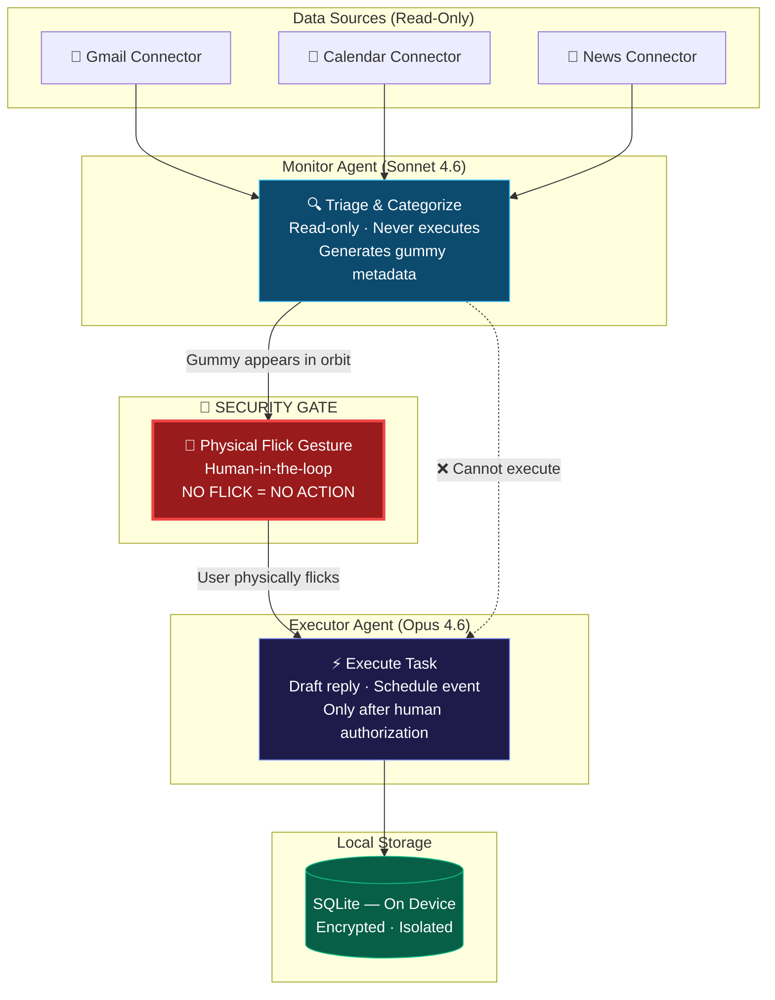
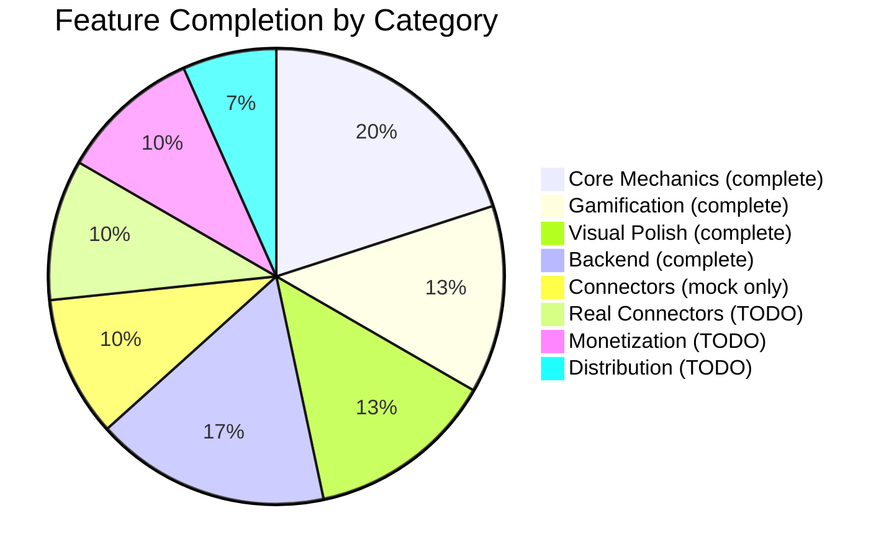

# 🫧 Gummy Bots — Project Progress Report #2

> **Date:** 2026-03-27 22:24 AWST
> **Repo:** [github.com/valter-silva-au/gummy-bots](https://github.com/valter-silva-au/gummy-bots)
> **Overall Status:** ✅ v1 Build Complete | 🔄 Product Review In Progress

---

## Project Timeline

```mermaid
timeline
    title Gummy Bots — From Idea to Product in One Day
    section Ideation (20:06)
        Voice memo : Valter describes the bilhar/gude concept
        Concept named : "Gummy Bots" 🫧
    section Documentation (22:07-22:10)
        Concept doc : CONCEPT.md written
        Idea doc : docs/idea.md — full product vision
    section Research (17:17 next day)
        Deep research : Valter's Google deep dive
        Market analysis : 58 sources, competitive landscape, security risks
    section Architecture (18:08-18:35)
        GitHub repo : Created + pushed
        CLAUDE.md : Project context for Claude Code
        Memory bank : RooFlow-style persistent context
        Harness : Anthropic 3-agent sprint workflow
        gstack : Garry Tan's 28 skills installed
    section Build (18:57-19:44)
        Sprint 1-4 : Foundation — Go server, Bedrock, mobile physics, web app
        Sprint 5-8 : Core loop — pipeline, feedback, personality, gamification
        Sprint 9-11 : Intelligence — orbits, tooltips, mock connectors
        Sprint 12-14 : Polish — evolution, achievements, integration
    section Review (22:21)
        Office Hours : gstack YC-style product challenge (in progress)
```

---

## Current State

```mermaid
graph TB
    subgraph "✅ COMPLETE"
        direction TB
        C1[🏗️ Go Backend<br/>2,024 lines<br/>11 Go files]
        C2[🌐 React Web App<br/>1,941 lines<br/>8 TS/TSX files]
        C3[📱 Expo Mobile App<br/>832 lines<br/>6 TS/TSX files]
        C4[📋 14 Sprint Contracts<br/>+ Evaluations]
        C5[📄 Product Docs<br/>idea.md + market-research.md]
        C6[🧠 Memory Bank<br/>4 context files]
    end

    subgraph "🔄 IN PROGRESS"
        P1[🎯 gstack /office-hours<br/>YC Product Challenge<br/>Running now...]
    end

    subgraph "📋 NEXT UP"
        N1[/review — Staff engineer code review]
        N2[/plan-ceo-review — Scope challenge]
        N3[/qa — Real browser testing]
        N4[/cso — Security audit]
        N5[/design-review — AI slop detection]
    end

    P1 -->|feeds into| N1
    P1 -->|feeds into| N2
    N1 --> N3
    N2 --> N4
    N3 --> N5

    style C1 fill:#065f46,stroke:#10b981,color:#fff
    style C2 fill:#065f46,stroke:#10b981,color:#fff
    style C3 fill:#065f46,stroke:#10b981,color:#fff
    style C4 fill:#065f46,stroke:#10b981,color:#fff
    style C5 fill:#065f46,stroke:#10b981,color:#fff
    style C6 fill:#065f46,stroke:#10b981,color:#fff
    style P1 fill:#92400e,stroke:#f59e0b,color:#fff
    style N1 fill:#1e3a5f,stroke:#3b82f6,color:#fff
    style N2 fill:#1e3a5f,stroke:#3b82f6,color:#fff
    style N3 fill:#1e3a5f,stroke:#3b82f6,color:#fff
    style N4 fill:#1e3a5f,stroke:#3b82f6,color:#fff
    style N5 fill:#1e3a5f,stroke:#3b82f6,color:#fff
```

---

## Architecture (Implemented)

```mermaid
graph TB
    subgraph "🖥️ Everything Runs Locally"
        subgraph "Go Backend — server/ (2,024 LOC)"
            MAIN[main.go — Entry + Graceful Shutdown]
            subgraph "API Layer"
                ROUTER[router.go — 461 LOC<br/>REST + CORS + Middleware]
                WS_HUB[ws.go — 163 LOC<br/>WebSocket Hub + Broadcast]
                HELPERS[helpers.go — JSON helpers]
            end
            subgraph "Intelligence"
                BEDROCK[bedrock.go — 303 LOC<br/>Monitor Agent: Sonnet 4.6<br/>Executor Agent: Opus 4.6]
            end
            subgraph "Data"
                STORE[db.go — 332 LOC<br/>SQLite + Migrations]
                XP[xp.go — 163 LOC<br/>Levels + Combos]
                ACHIEVE[achievements.go — 65 LOC<br/>8 Definitions]
                GUMMY_P[gummy.go — 48 LOC<br/>Priority + Color Mapping]
            end
            subgraph "Connectors"
                MOCK[mock.go — 331 LOC<br/>Gmail + Calendar + News]
                IFACE[connector.go — Interface]
            end
        end

        subgraph "React Web — web/ (1,941 LOC)"
            CANVAS[GameCanvas.tsx — 211 LOC<br/>Full Canvas Renderer]
            RENDERER[renderer.ts — 974 LOC<br/>Bot + Gummies + Particles<br/>Evolution + Achievements]
            PHYSICS[physics.ts — 440 LOC<br/>2D Physics + Orbits<br/>Gravity Wells + Collision]
            AUDIO_E[audio.ts — 117 LOC<br/>ASMR Pop + Synth]
            TYPES[types.ts — 109 LOC]
            WS_WEB[useWebSocket.ts — 73 LOC]
        end

        subgraph "Expo Mobile — app/ (832 LOC)"
            GUMMY_F[GummyField.tsx — 374 LOC<br/>Orbit + Flick + Catch]
            BOT[BotOrb.tsx — 217 LOC<br/>Breathing + Glow + States]
            TOAST[DoneToast.tsx — 84 LOC]
            WS_MOB[useWebSocket.ts — 67 LOC]
            DOCK[ConnectorDock.tsx — 57 LOC]
            STATUS[StatusHeader.tsx — 33 LOC]
        end

        DB[(SQLite<br/>users · tasks · gummies<br/>xp · streaks · achievements)]
    end

    subgraph "☁️ Amazon Bedrock Only"
        SONNET[Sonnet 4.6 — Fast Triage]
        OPUS[Opus 4.6 — Execution]
    end

    MAIN --> ROUTER & WS_HUB
    ROUTER --> BEDROCK & STORE & XP & ACHIEVE & GUMMY_P
    MOCK -->|Auto-generate tasks| WS_HUB
    WS_WEB <-->|WebSocket| WS_HUB
    WS_MOB <-->|WebSocket| WS_HUB
    STORE --> DB
    BEDROCK -->|API Key Auth| SONNET & OPUS

    style DB fill:#1e1b4b,stroke:#818cf8,color:#fff
    style SONNET fill:#0c4a6e,stroke:#38bdf8,color:#fff
    style OPUS fill:#0c4a6e,stroke:#38bdf8,color:#fff
```



---

## Sprint Delivery Map

```mermaid
graph LR
    subgraph "Phase 1: Foundation"
        S1[Sprint 1<br/>Go Server<br/>✅ 7.8/10]
        S2[Sprint 2<br/>Bedrock LLM<br/>✅ 7.8/10]
        S3[Sprint 3<br/>Mobile Physics<br/>✅ 8.0/10]
        S4[Sprint 4<br/>React Web<br/>✅ 7.8/10]
    end

    subgraph "Phase 2: Core Loop"
        S5[Sprint 5<br/>Task Pipeline<br/>✅ 7.8/10]
        S6[Sprint 6<br/>ASMR Feedback<br/>✅ 7.8/10]
        S7[Sprint 7<br/>Bot States<br/>✅ 7.8/10]
        S8[Sprint 8<br/>XP + Streaks<br/>✅ 7.8/10]
    end

    subgraph "Phase 3: Intelligence"
        S9[Sprint 9-11<br/>Orbits + Tooltips<br/>+ Connectors<br/>✅ 8.8/10]
    end

    subgraph "Phase 4: Polish"
        S12[Sprint 12<br/>Bot Evolution<br/>✅ 7.8/10]
        S13[Sprint 13<br/>Achievements<br/>✅ 8.0/10]
        S14[Sprint 14<br/>Integration<br/>✅ 8.0/10]
    end

    S1 --> S2 --> S3 --> S4 --> S5 --> S6 --> S7 --> S8 --> S9 --> S12 --> S13 --> S14

    style S1 fill:#065f46,stroke:#10b981,color:#fff
    style S2 fill:#065f46,stroke:#10b981,color:#fff
    style S3 fill:#065f46,stroke:#10b981,color:#fff
    style S4 fill:#065f46,stroke:#10b981,color:#fff
    style S5 fill:#065f46,stroke:#10b981,color:#fff
    style S6 fill:#065f46,stroke:#10b981,color:#fff
    style S7 fill:#065f46,stroke:#10b981,color:#fff
    style S8 fill:#065f46,stroke:#10b981,color:#fff
    style S9 fill:#065f46,stroke:#10b981,color:#fff
    style S12 fill:#065f46,stroke:#10b981,color:#fff
    style S13 fill:#065f46,stroke:#10b981,color:#fff
    style S14 fill:#065f46,stroke:#10b981,color:#fff
```



---

## Tooling Stack



---

## Security Architecture



**Key insight from market research:** Indirect prompt injection is the #1 threat to email-reading AI agents. The flick mechanic solves this architecturally — a malicious email cannot trigger autonomous execution because the physical gesture IS the authorization.

---

## Metrics

| Metric | Value |
|--------|-------|
| **Total commits** | 16 |
| **Total code** | 4,797 lines |
| **Go backend** | 2,024 lines (11 files) |
| **React web** | 1,941 lines (8 files) |
| **Expo mobile** | 832 lines (6 files) |
| **Sprint docs** | 28 files (contracts + evaluations) |
| **Product docs** | 8 files |
| **gstack skills** | 28 installed |
| **Build time** | 47 minutes (14 sprints) |
| **Avg sprint score** | 7.9/10 |
| **Highest score** | 8.8/10 (Sprint 9-11: Orbits + Connectors) |
| **Time from idea to v1** | ~24 hours |

---

## Feature Completion



### Detailed Feature Status

| Category | Feature | Status |
|----------|---------|--------|
| **Core** | Flick-to-execute physics | ✅ Complete |
| | Magnetic snapping + gravity wells | ✅ Complete |
| | Bot catch animation | ✅ Complete |
| | Dismiss/snooze (flick away) | ✅ Complete |
| | WebSocket real-time sync | ✅ Complete |
| | Bedrock LLM integration | ✅ Complete |
| **Gamification** | XP + Level progression | ✅ Complete |
| | Daily streaks | ✅ Complete |
| | Combo multiplier | ✅ Complete |
| | 8 Achievements + trophy panel | ✅ Complete |
| **Visual** | Bot personality (4 states) | ✅ Complete |
| | Bot evolution (4 stages) | ✅ Complete |
| | ASMR pop audio + particles | ✅ Complete |
| | Dark game aesthetic | ✅ Complete |
| **Backend** | Go HTTP + WebSocket server | ✅ Complete |
| | SQLite persistence | ✅ Complete |
| | Monitor agent (Sonnet) | ✅ Complete |
| | Executor agent (Opus) | ✅ Complete |
| | Task pipeline | ✅ Complete |
| **Connectors** | Mock Gmail | ✅ Complete |
| | Mock Calendar | ✅ Complete |
| | Mock News | ✅ Complete |
| | Real Gmail OAuth2 | 🔲 TODO |
| | Real Calendar OAuth2 | 🔲 TODO |
| | Real Slack OAuth2 | 🔲 TODO |
| **Monetization** | Bot skins store | 🔲 TODO |
| | Sound packs IAP | 🔲 TODO |
| | Pro tier subscription | 🔲 TODO |
| **Distribution** | App Store submission | 🔲 TODO |
| | Landing page | 🔲 TODO |

---

## Active: gstack /office-hours

Currently running Garry Tan's YC-style product interrogation. This will:

1. **Challenge the product framing** — is "gamified task flicking" the real product?
2. **Push back on assumptions** — is physics-as-moat defensible?
3. **Question monetization** — will bot skins generate enough revenue?
4. **Probe go-to-market** — how do we get first 1,000 users?
5. **Find the 10-star product** — what's the bigger vision hiding inside?

Output will be written to `docs/office-hours-review.md`.

---

## What's Next (Priority Order)

```mermaid
graph TD
    NOW[🔄 NOW: gstack /office-hours<br/>Product challenge]
    NEXT1[/review — Code quality audit]
    NEXT2[/cso — Security audit<br/>OWASP + STRIDE]
    NEXT3[/design-review — AI slop check]
    NEXT4[Real Gmail connector]
    NEXT5[Real Calendar connector]
    NEXT6[Landing page]
    NEXT7[App Store submission]

    NOW --> NEXT1 --> NEXT2 --> NEXT3
    NEXT3 --> NEXT4 --> NEXT5
    NEXT5 --> NEXT6 --> NEXT7

    style NOW fill:#92400e,stroke:#f59e0b,color:#fff
    style NEXT1 fill:#1e3a5f,stroke:#3b82f6,color:#fff
    style NEXT2 fill:#7f1d1d,stroke:#ef4444,color:#fff
    style NEXT3 fill:#581c87,stroke:#a855f7,color:#fff
    style NEXT4 fill:#065f46,stroke:#10b981,color:#fff
    style NEXT5 fill:#065f46,stroke:#10b981,color:#fff
    style NEXT6 fill:#065f46,stroke:#10b981,color:#fff
    style NEXT7 fill:#065f46,stroke:#10b981,color:#fff
```

---

*Generated: 2026-03-27 22:24 AWST | Project age: ~26 hours from voice memo to working product*
