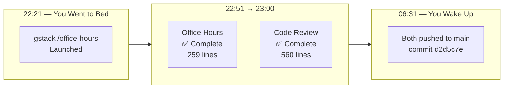
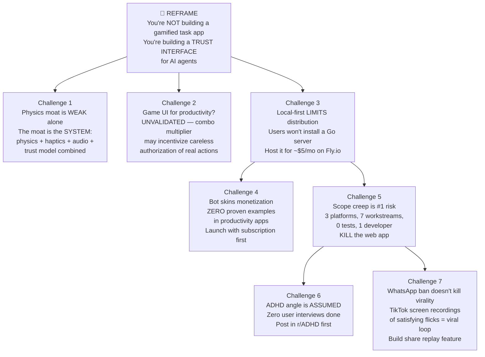
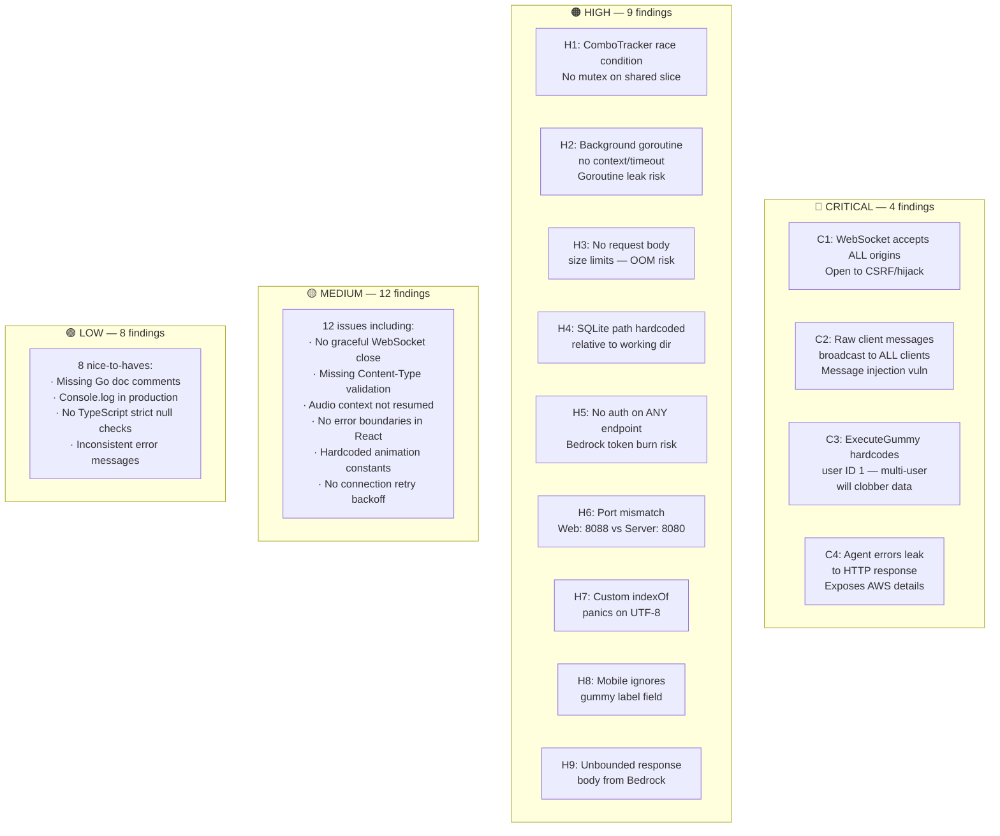
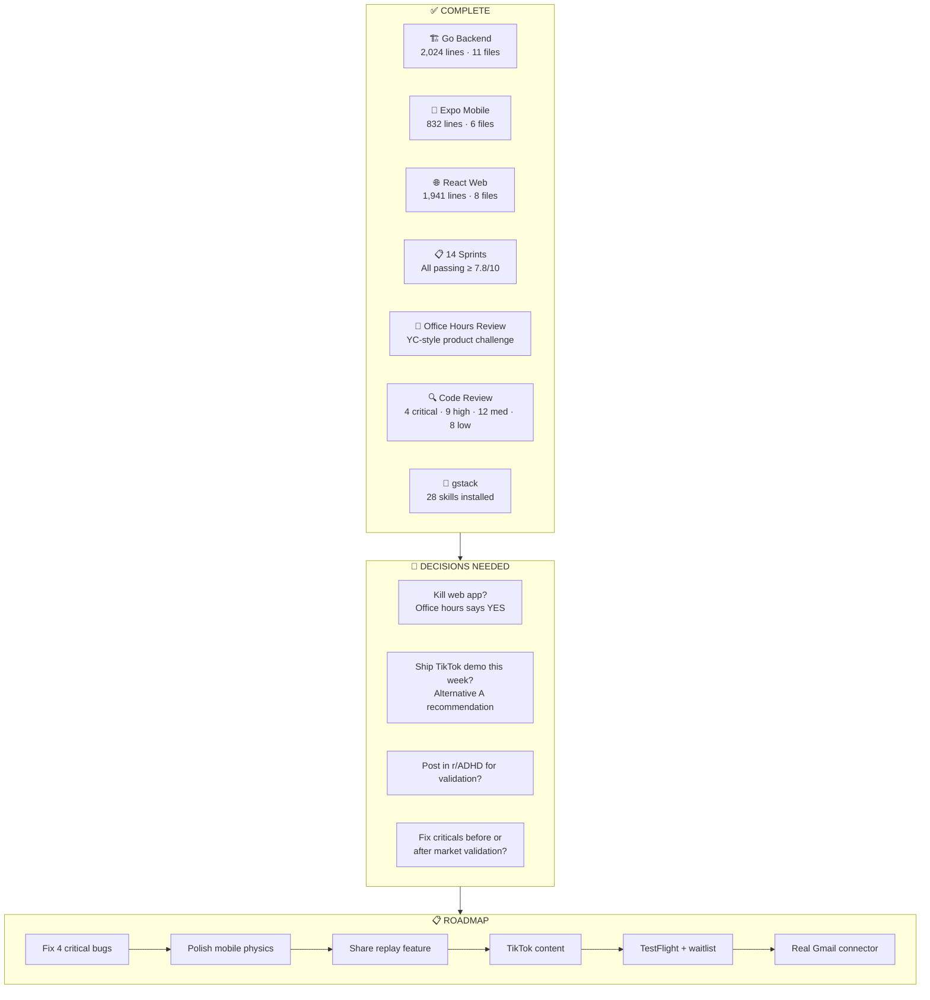
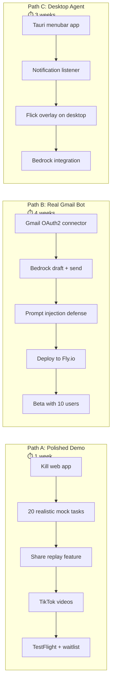

# 🫧 Gummy Bots — Progress Report #3 (Morning Update)

> **Date:** 2026-03-28 06:31 AWST
> **Repo:** [github.com/valter-silva-au/gummy-bots](https://github.com/valter-silva-au/gummy-bots)
> **Overall Status:** ✅ v1 Complete | ✅ Product Review Done | ✅ Code Review Done

---

## Overnight Work Summary

While you slept, Claude Code completed two major reviews:

1. **gstack /office-hours** — Full YC-partner product interrogation (259 lines)
2. **Staff Engineer Code Review** — Full codebase audit (560 lines, 33 findings)

Both committed and pushed to main.

---

## What Changed Overnight

---

## Office Hours: Key Findings

### The Big Reframe

> "Stop thinking of this as a productivity app that's fun. Start thinking of it as **the first trust-native interface for AI agents.** The gamification is the spoonful of sugar. The real product is giving humans a physical sense of control over their AI workers."

### The 10-Star Product Vision

> You wake up. Your phone shows your bot, surrounded by 3 gummies. One blue ("Mom texted — I've drafted 'Yes! I'll bring dessert'"), one green ("Dentist moved to Thursday 3pm — already confirmed"), one orange ("That Rust article — here's the 3-sentence summary"). Flick. Flick. Flick. 15 seconds. Inbox zero. You haven't opened Gmail in 6 months.

### Ship THIS WEEK Recommendation

| Day | Action |
|-----|--------|
| **Mon** | Kill the web/ directory. It's a distraction. |
| **Tue** | Add 20 realistic hardcoded tasks with timed appearance. Polish pop sounds. |
| **Wed** | Add "share replay" — export last 10s as MP4 with watermark. |
| **Thu** | Record 5 TikTok-style videos. Slow-mo flicks, ASMR audio. |
| **Fri** | Ship to TestFlight. Post videos. Set up waitlist at gummybots.app. |

---

## Code Review: 33 Findings

### Critical Fix Priority

| # | Issue | Risk | Fix Effort |
|---|-------|------|-----------|
| C1 | WebSocket accepts all origins | Hijack | 10 min |
| C2 | Raw messages broadcast to all | Injection | 30 min |
| C3 | Hardcoded user ID 1 | Data loss | 20 min |
| C4 | Agent errors leak to client | Info disclosure | 10 min |
| H1 | ComboTracker race condition | Panic/corruption | 15 min |
| H5 | No auth on any endpoint | Token burn | 45 min |
| H6 | Port mismatch 8088 vs 8080 | App won't connect | 5 min |

---

## Full Project Status

---

## Metrics Summary

| Metric | Value |
|--------|-------|
| **Total commits** | 18 |
| **Total code** | 4,797 lines |
| **Go backend** | 2,024 lines |
| **React web** | 1,941 lines |
| **Expo mobile** | 832 lines |
| **Sprint docs** | 28 files |
| **Product docs** | 10 files (including reviews) |
| **gstack skills** | 28 installed |
| **Build time** | 47 min (14 sprints) |
| **Code review findings** | 4 critical, 9 high, 12 medium, 8 low |
| **Time from idea to v1** | ~26 hours |
| **Time from v1 to reviewed** | +4 hours |

---

## Three Strategic Paths Forward

**Office hours recommendation:** Ship Path A this week. Validate demand with a TikTok video before building more. If video gets >10K views and >500 waitlist signups → move to Path B. If not → rethink.

---

## Full Docs Available

| Document | Location | Lines |
|----------|----------|------:|
| Office Hours Review | `docs/office-hours-review.md` | 259 |
| Code Review | `docs/code-review.md` | 560 |
| Product Vision | `docs/idea.md` | 260 |
| Market Research | `docs/market-research.md` | 300+ |
| Harness Design | `docs/harness.md` | 140 |
| Progress Report #2 | `docs/progress-report-2.md` | 196 |

---

*Generated: 2026-03-28 06:31 AWST | Overnight work: 2 reviews completed autonomously*
