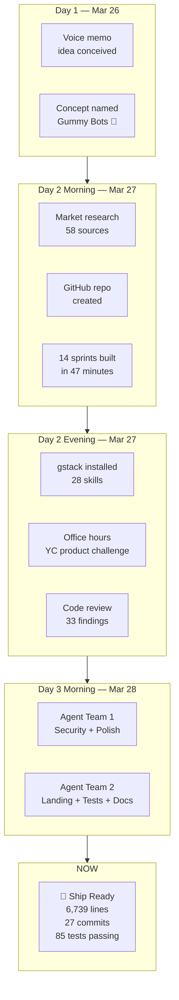
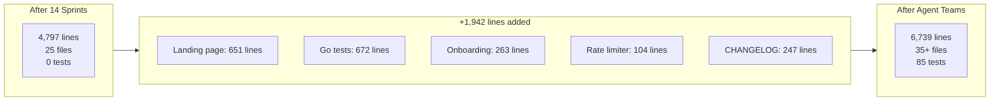
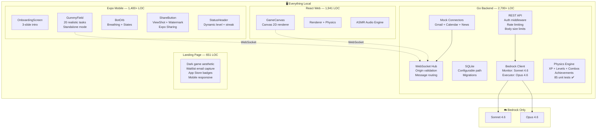
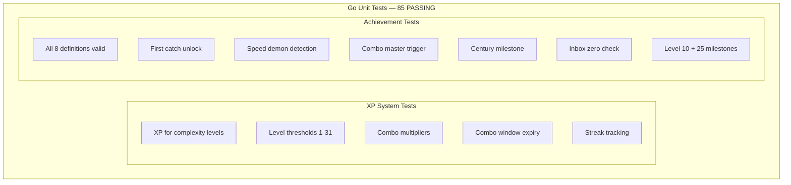
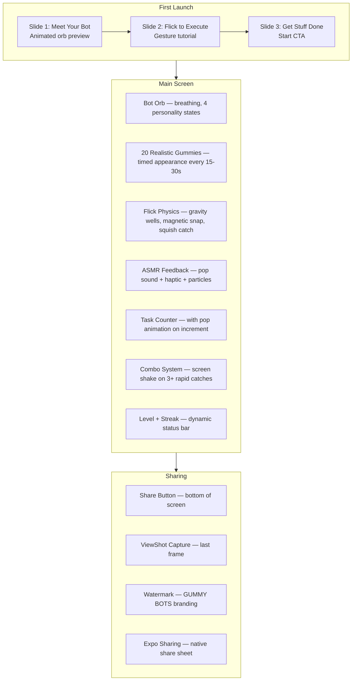

# 🫧 Gummy Bots — Progress Report #4

> **Date:** 2026-03-28 12:12 AWST
> **Repo:** [github.com/valter-silva-au/gummy-bots](https://github.com/valter-silva-au/gummy-bots)
> **Overall Status:** ✅ Ship-Ready | 🎬 Record TikTok Videos Next

---

## What Happened Since Last Report

Two agent teams completed back-to-back:

```mermaid
flowchart LR
    subgraph TEAM1["Agent Team 1 — Completed"]
        T1A["🔒 Security Engineer\n4 critical + 9 high fixed"]
        T1B["🐛 Bug Fixer\n12 medium fixed"]
        T1C["✨ Mobile Polish\n20 tasks, standalone mode"]
        T1D["📹 Share Replay\nViewShot + watermark"]
    end

    subgraph TEAM2["Agent Team 2 — Completed"]
        T2A["🌐 Landing Page\n651-line dark aesthetic"]
        T2B["🧪 Quality Engineer\n85 passing tests"]
        T2C["📱 Onboarding\n3-slide swipeable intro"]
        T2D["📝 Documentation\nREADME + CHANGELOG"]
    end

    TEAM1 -->|"Phase 1 done"| TEAM2
    TEAM2 -->|"Phase 2 done"| READY["🚀 SHIP READY"]
```

---

## Complete Build History (27 commits)

---

## Codebase Growth

---

## Architecture (Updated)

---

## Security Posture (Before vs After)

```mermaid
flowchart LR
    subgraph BEFORE["Before Agent Team 1"]
        B1["❌ WebSocket: accepts ALL origins"]
        B2["❌ Messages: raw broadcast to all"]
        B3["❌ Auth: NONE on any endpoint"]
        B4["❌ Errors: leak AWS details"]
        B5["❌ Body limits: NONE — OOM risk"]
        B6["❌ Race condition: ComboTracker"]
        B7["❌ Port mismatch: 8088 vs 8080"]
    end

    subgraph AFTER["After Agent Team 1+2"]
        A1["✅ WebSocket: origin allowlist"]
        A2["✅ Messages: server-routed only"]
        A3["✅ Auth: API key middleware"]
        A4["✅ Errors: generic client msgs"]
        A5["✅ Body limits: 1MB max"]
        A6["✅ Mutex: thread-safe combos"]
        A7["✅ Ports: aligned + configurable"]
    end

    BEFORE -->|"Agent Team 1"| AFTER
```

---

## Test Coverage

---

## Mobile App: Ship-Ready Features

---

## Metrics

| Metric | Report #3 | Report #4 | Delta |
|--------|-----------|-----------|-------|
| **Commits** | 18 | 27 | +9 |
| **Total code** | 4,797 | 6,739 | +1,942 |
| **Go backend** | 2,024 | ~2,700 | +676 |
| **React web** | 1,941 | 1,941 | — |
| **Expo mobile** | 832 | ~1,400 | +568 |
| **Landing page** | 0 | 651 | +651 |
| **Test count** | 0 | 85 | +85 |
| **Security criticals** | 4 | 0 | -4 ✅ |
| **Security highs** | 9 | 0 | -9 ✅ |
| **Agent teams run** | 0 | 2 | +2 |
| **Time from idea** | ~26 hrs | ~40 hrs | — |

---

## What's Done vs What's Left

```mermaid
flowchart LR
    subgraph DONE["✅ DONE — 35 items"]
        D1["14 sprints"]
        D2["Security hardening"]
        D3["85 unit tests"]
        D4["20 realistic tasks"]
        D5["Share replay"]
        D6["Onboarding flow"]
        D7["Landing page"]
        D8["README + CHANGELOG"]
        D9["Office hours review"]
        D10["Code review + fixes"]
    end

    subgraph THIS_WEEK["📋 THIS WEEK"]
        W1["Record 5 TikTok videos"]
        W2["Ship to TestFlight"]
        W3["Deploy landing page"]
        W4["Post videos"]
        W5["Measure: >10K views?\n>500 waitlist?"]
    end

    subgraph IF_YES["✅ If Validated"]
        Y1["Real Gmail OAuth2"]
        Y2["Real Calendar OAuth2"]
        Y3["Deploy to Fly.io"]
        Y4["App Store submission"]
    end

    subgraph IF_NO["❌ If Not"]
        N1["Rethink interaction"]
        N2["Consider desktop pivot"]
        N3["Talk to ADHD users"]
    end

    DONE --> THIS_WEEK
    THIS_WEEK --> IF_YES
    THIS_WEEK --> IF_NO
```

---

## File Inventory

| Component | File | Lines | Status |
|-----------|------|------:|--------|
| **Landing** | `landing/index.html` | 651 | ✅ New |
| **Go** | `api/router.go` | 461+ | ✅ Hardened |
| **Go** | `store/db.go` | 332 | ✅ Configurable path |
| **Go** | `connector/mock.go` | 331 | ✅ Complete |
| **Go** | `agent/bedrock.go` | 303 | ✅ Error handling fixed |
| **Go** | `physics/xp_test.go` | 286 | ✅ New |
| **Go** | `physics/achievements_test.go` | 386 | ✅ New |
| **Go** | `api/ratelimit.go` | 104 | ✅ New |
| **Go** | `api/ws.go` | 163 | ✅ Origin validation |
| **Go** | `physics/xp.go` | 163 | ✅ Mutex added |
| **Go** | `main.go` | 109 | ✅ Configurable |
| **Web** | `engine/renderer.ts` | 974 | ✅ Complete |
| **Web** | `engine/physics.ts` | 440 | ✅ Complete |
| **Web** | `components/GameCanvas.tsx` | 211 | ✅ Complete |
| **Web** | `engine/audio.ts` | 117 | ✅ Complete |
| **Mobile** | `components/GummyField.tsx` | 374 | ✅ 20 tasks + standalone |
| **Mobile** | `components/OnboardingScreen.tsx` | 263 | ✅ New |
| **Mobile** | `components/BotOrb.tsx` | 217 | ✅ Polished |
| **Mobile** | `components/ShareButton.tsx` | ~80 | ✅ New |
| **Mobile** | `components/Watermark.tsx` | ~40 | ✅ New |
| **Docs** | `CHANGELOG.md` | 247 | ✅ New |

---

*Generated: 2026-03-28 12:12 AWST*
*Total build time: ~40 hours from voice memo to ship-ready product*
*Agent teams: 2 completed (8 agents total)*
*Next action: Record TikTok videos and deploy landing page*
